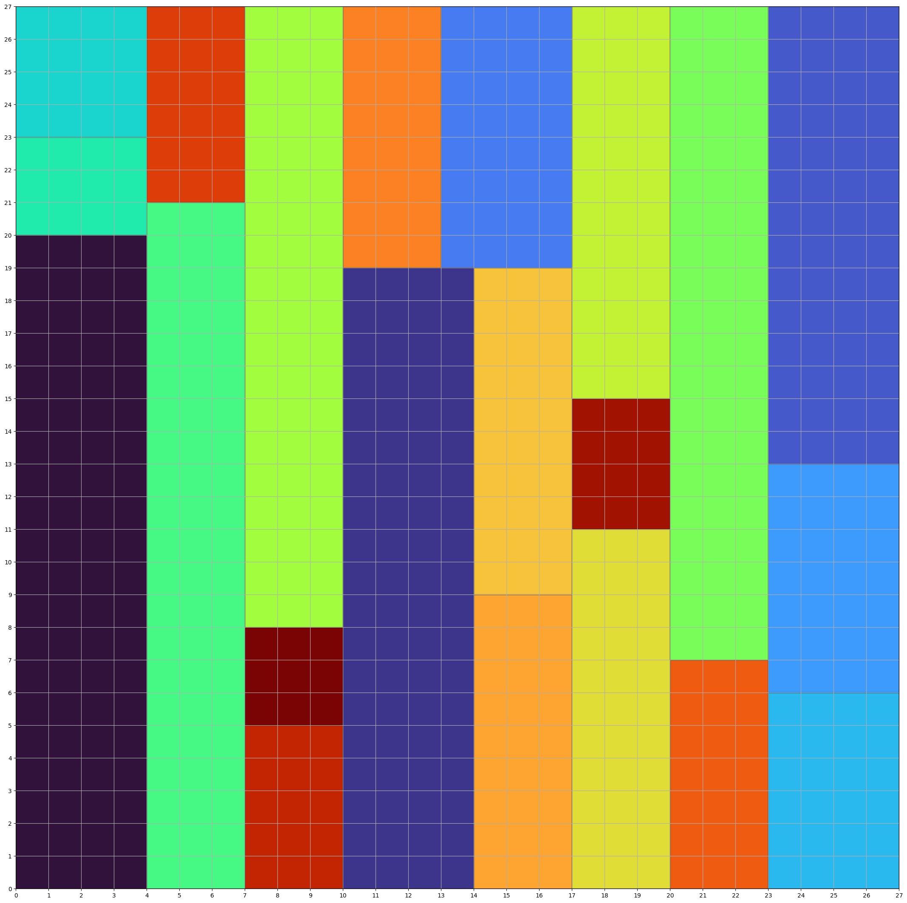
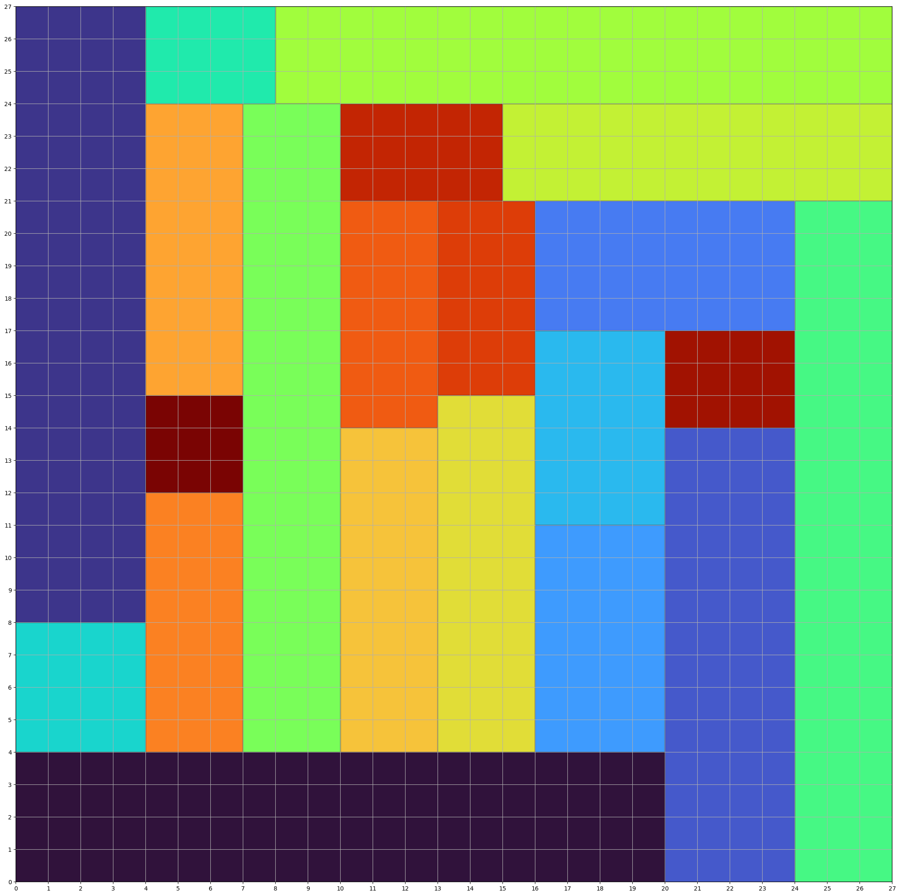

# VLSI Design
The project was developed for the "Combinatorial Decision Making and Optimization" course at the Artificial Intelligence master's degree at the University of Bologna.
## Problem description

VLSI (Very Large Scale Integration) refers to the trend of integrating circuits into silicon chips. A typical example is the smartphone.

The modern trend of  shrinking transistor sizes, allowing engineers to fit more and more transistors into the same area of silicon, has pushed the integration of more and more functions of cellphone circuitry into a single silicon die (i.e. plate).
This enabled  the modern cellphone to mature into a powerful tool that shrank from the size of  a large brick-sized unit to a device small enough to comfortably carry in a pocket  or purse, with a video camera, touchscreen, and other advanced features. 

We considered two variants of the problem. In the first, each circuit must be placed in a fixed orientation with respect to the others. This means that, an n × m circuit cannot be positioned as an m × n circuit in the silicon plate. In the second case, the rotation is allowed, which means that an n × m circuit can be positioned either as it is or as m × n.

<span>
  <figure style="display:inline">
    
  </figure>
</span>
<span>
  <figure  style="display:inline">
    
  </figure>
</span>

Example with the 20-th instance, the solution on the left is without rotation and the one on the right is with rotation allowed.

## Implementation

We developed 3 models with different approaches:
- Constraint Programming (CP)
- Satisfiable Modulo Theory (SMT)
- Linear Programming (LP)

 You can find the assignment [here](assignment.pdf), in particular we chose **Problem 1**. 

For each technique we implemented the basic version of the model and the one with rotation allowed, the goal is obviously to find the optimal solution for the largest number of instances.

You can find more information on how to test the different models in the relative ```<technique>/src ``` directories.

## Installation

You can clone this repo on your machine and move to the project directory:
```shell
git clone https://github.com/Valendrew/VLSI-Design.git
cd VLSI-Design
```

Now create a conda environment and activate it:
```shell
conda env create -f environment.yml
conda activate unibo-cdmo
```
At this point if there are further steps necessary to run the different solvers you can find more instructions in the specific ```<technique>/src/README.md ``` for each model.

## Folder structure
For any model we used the same structure for the directories, in particular:
- *<Model\>/src/*: the source code for \<Model\>
  - *README*: basic instructions for execution
- *<Model\>/out/[base | rotation]*:
  - /plot/: the images of the solutions found by the solver.
  - ins-?.txt, are all the .txt files that contains the solutions added to the input files.
  - /statistics/: the .csv files that contain information about the different executions.
